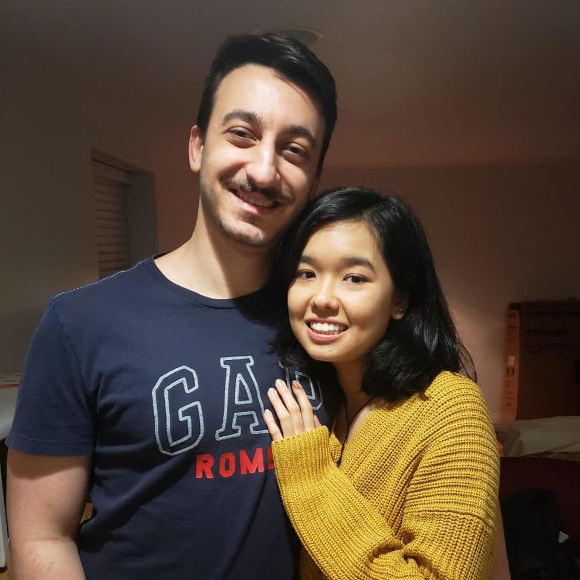
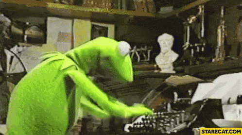

class: inverse, center, middle

# Who I am

---
# Who I am

.pull-left[
- Born and raised in Brazil
]

.pull-right[

]

---
# Who I am

.pull-left[
- Born and raised in Brazil
]

.pull-right[

]


---
# Who I am

.pull-left[
- Born and raised in Brazil
- Graduated from the University of Campinas with a BSc in Stats
]

.pull-right[

]

---
# Who I am

.pull-left[
- Born and raised in Brazil
- Graduated from the University of Campinas with a BSc in Stats
- Moved to Vancouver with my girlfriend Akari in 2021
]

.pull-right[

]

---
# Who I am

.pull-left[
- Born and raised in Brazil
- Graduated from the University of Campinas with a BSc in Stats
- Moved to Vancouver with my girlfriend Akari in 2021
]

.pull-right[

]

---
# Who I am

.pull-left[
- Born and raised in Brazil
- Graduated from the University of Campinas with a BSc in Stats
- Moved to Vancouver with my girlfriend Akari in 2021
- I LOVE math, stats and coding
]

.pull-right[

]

---
# Who I am

.pull-left[
- Born and raised in Brazil
- Graduated from the University of Campinas with a BSc in Stats
- Moved to Vancouver with my girlfriend Akari in 2021
- I LOVE math, stats and coding
]

.pull-right[

]

---
# Who I am

.pull-left[
- Born and raised in Brazil
- Graduated from the University of Campinas with a BSc in Stats
- Moved to Vancouver with my girlfriend Akari in 2021
- I LOVE math, stats and coding
]

.pull-right[

]

---
class: inverse, center, middle

# What I **used** to research

---
# What I **used** to research

.pull-left[
- **Research area:** Quantitative finance
]

.pull-right[

]

---
# What I **used** to research

.pull-left[
- **Research area:** Quantitative finance
- **Topics:**
    - Risk-based portfolios
]

.pull-right[
```{r, echo = FALSE, message = FALSE, warning = FALSE}
library(tidyverse)

set.seed(42)

A_log_returns <- rnorm(100, 0.01, 0.05)
B_log_returns <- rnorm(100, 0.01, 0.05)

data <- tibble(
    `Stock A` = exp(cumsum(A_log_returns)),
    `Stock B` = exp(cumsum(B_log_returns)),
    Portfolio = (exp(cumsum(A_log_returns)) + exp(cumsum(B_log_returns))) / 2
)

data %>%
    mutate(Time = row_number()) %>%
    pivot_longer(-Time, names_to = "Investment", values_to = "Value") %>%
    ggplot(aes(x = Time, y = Value, color = Investment)) +
    geom_line(size = 2) +
    theme_minimal(16)
```
]

---
# What I **used** to research

.pull-left[
- **Research area:** Quantitative finance
- **Topics:**
    - Risk-based portfolios
    - High dimensional time series
]

.pull-right[
1000 stocks with 10 years of data

≈ 200 parameters per observation 😱
]

---
# What I **used** to research

.pull-left[
- **Research area:** Quantitative finance
- **Topics:**
    - Risk-based portfolios
    - High dimensional time series
    - Covariance matrix estimators
]

.pull-right[
High dimensional + shrinkage = ❤️
]


---
# What I **used** to research

.pull-left[
- **Research area:** Quantitative finance
- **Topics:**
    - Risk-based portfolios
    - High dimensional time series
    - Covariance matrix estimators
- **Extra:**
    - [Python package](https://github.com/GiuseppeTT/hdrbp) for my research
    - Interned at Goldman Sachs
]

.pull-right[
]

---
class: inverse, center, middle

# What I **plan** to research

---
# What I **plan** to research

.pull-left[
- Honestly, I'm still figuring it out 😅
]

.pull-right[
]

---
# What I **plan** to research

.pull-left[
- Honestly, I'm still figuring it out 😅
- Original talk with Keegan was to develop a model for methylation data based on the negative binomial distribution
]

.pull-right[

]

---
# What I **plan** to research

.pull-left[
- Honestly, I'm still figuring it out 😅
- Original talk with Keegan was to develop a model for methylation data based on the negative binomial
- Later Gaby joined for a co supervision and we plan to include causal inference
]

.pull-right[

]

---
# What I **plan** to research

.pull-left[
- Honestly, I'm still figuring it out 😅
- Original talk with Keegan was to develop a model for methylation data based on the negative binomial
- Later Gaby joined for a co supervision and we plan to include causal inference
- I have to write a proposal till the end of April, so I'll update you soon
]

.pull-right[

]

---
# What I **plan** to research

.pull-left[
- Honestly, I'm still figuring it out 😅
- Original talk with Keegan was to develop a model for methylation data based on the negative binomial
- Later Gaby joined for a co supervision and we plan to include causal inference
- I have to write a proposal till the end of April, so I'll update you soon
- I hope to interact with you a lot 😁
]

.pull-right[

]
